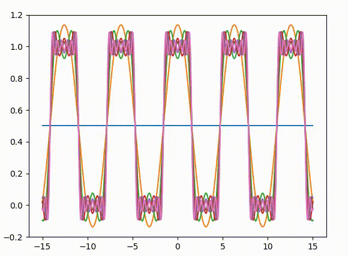

# Fourier Series Visualizer

Repo contains a small Python program that visualizes the Fourier Series by plotting its graph. To use this program, install the following packages (via pip for example):
* [Numpy](http://www.numpy.org/)
* [Scipy](http://www.scipy.org/)
* [Matplotlib](https://matplotlib.org/)

Demo:

